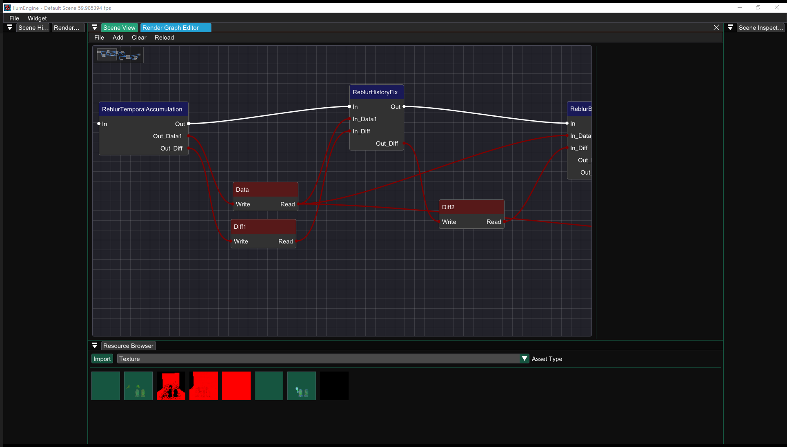
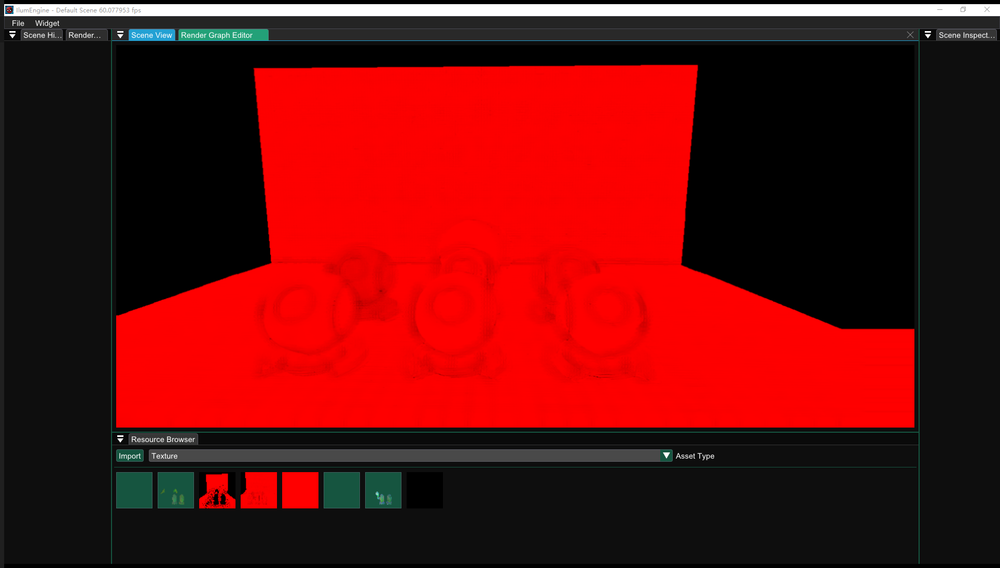

# Ilum Engine - NRD CUDA Test

## Feature

* Vulkan RHI Backend
* CUDA Interop Support
* Seamless CUDA Pass Embedded
* Shader Compilation Chain: HLSL(From UE5) -> DXC -> SPIR-V -> SPIRV-CROSS -> HLSL -> SLANG -> PTX

## Result

