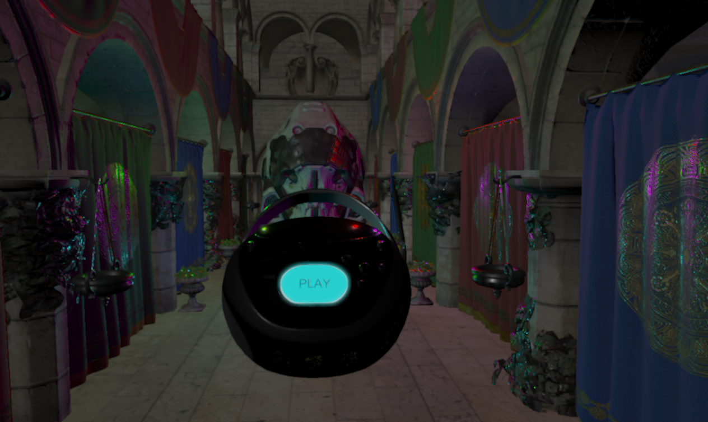
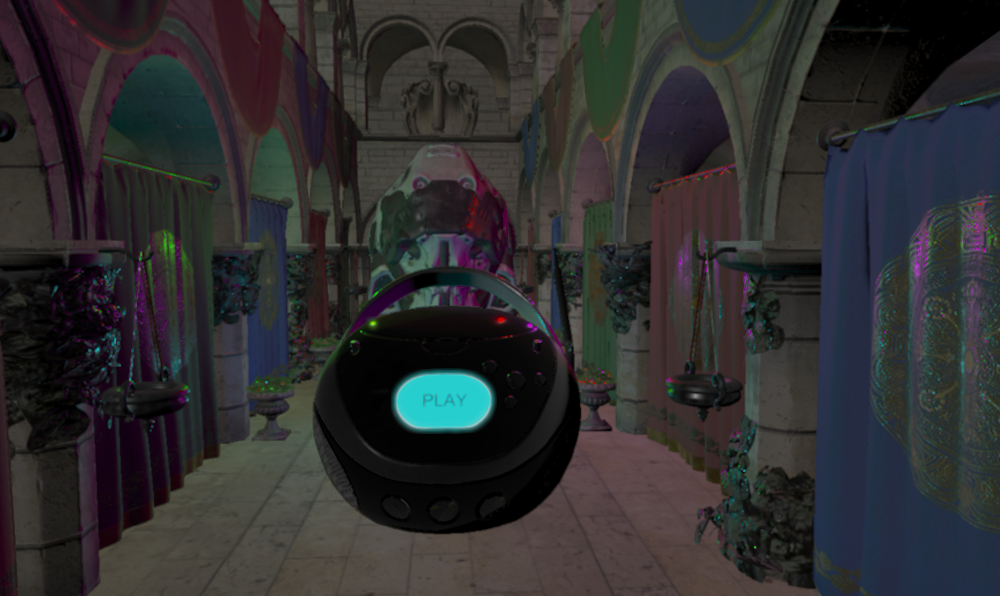

# Ilum(WIP)

[](https://github.com/Chaf-Libraries/Ilum/actions/workflows/windows.yml) [](https://www.codacy.com/gh/Chaf-Libraries/IlumEngine/dashboard?utm_source=github.com&amp;utm_medium=referral&amp;utm_content=Chaf-Libraries/IlumEngine&amp;utm_campaign=Badge_Grade)

Ilum Graphics Playground, name after *Planet Ilum* from [Star Wars](https://starwars.fandom.com/es/wiki/Ilum)


## Build

* Windows 10
* Visual Studio 2019
* C++17
* CMake 3.14+

Run:

```shell
git clone https://github.com/Chaf-Libraries/Ilum --recursive
mkdir build
cd build
cmake ..
cmake --build ./ --target ALL_BUILD --config Release
```

## Vulkan Requirement

* Instance Extension
  * `VK_KHR_surface`
  * `VK_KHR_win32_surface`
  * `VK_EXT_debug_report`
  * `VK_EXT_debug_utils`
* Validation Layers
  * `VK_LAYER_KHRONOS_validation`
* Device Extension
  * `VK_KHR_swapchain`
  * `VK_KHR_acceleration_structure`
  * `VK_KHR_ray_tracing_pipeline`

## Feature

* Architecture
  * Render Graph
    * Customize Render Pass (Graphics, Compute, Ray Tracing)
    * Auto Resource Transition
    * Render Passes Visualization
    * Render Pass Setting
  * Runtime Shader Compilation
    * GLSL -> `glslang` -> SPIR-V
    * HLSL -> `DXC` -> SPIR-V
  * Entity Component System
  * Asynchronous Resource Loading
  * Scene Loading/Saving
* Rendering Feature For Performance
  * Multi-Draw Indirect
  * Bindless Texture
  * Vertex/Index Buffer Packing
  * GPU Frustum Culling
  * GPU Back-Face Cone Culling
  * GPU Hierarchy Z Buffer Occlusion Culling
* Geometry
  * Curve Modeling
    * Bézier Curve
    * Cubic Spline Curve
    * B Spline Curve
    * Rational Bézier Curve
    * Rational B Spline Curve

  * Tensor Product Surface Modeling
    * Bézier Surface
    * B Spline Surface
    * Rational Bézier Surface
    * Rational B Spline Surface
* Lighting Model
  * PBR
    * Cook-Torrance BRDF
    * Kulla-Conty Approximation
* Post Processing
  * Temporal Anti-Alias
  * Blooming


## Feature

### Deferred Shading

#### Cook-Torrance BRDF


#### Kulla-Conty Mutli-Bounce Approximation

| Multi-Bounce OFF                          | Multi-Bounce ON                        |
| ----------------------------------------- | -------------------------------------- |
|  |  |

### Render Passes Visualization


### Performance

#### Meshlet


#### Hierarchy Z Buffer Generation


#### Massive Scene Rendering


### Curve Modeling


### Surface Modeling


### Post Processing

#### Temporal Anti-Alias

|           TAA OFF            |         TAA ON         |
| :--------------------------: | :--------------------: |
|  |  |

#### Blooming

| Blooming OFF           | Blooming ON                |
| ---------------------- | -------------------------- |
|  |  |

