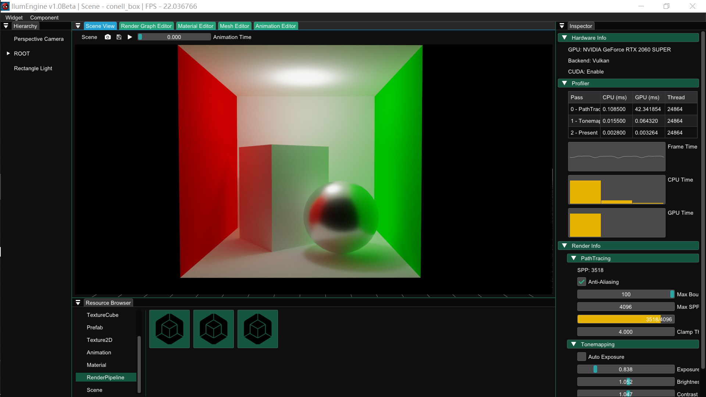

# Ilum(WIP)

[](https://github.com/Chaf-Libraries/Ilum/actions/workflows/windows.yml) [](https://www.codacy.com/gh/Chaf-Libraries/IlumEngine/dashboard?utm_source=github.com&amp;utm_medium=referral&amp;utm_content=Chaf-Libraries/IlumEngine&amp;utm_campaign=Badge_Grade)

Ilum Graphics Playground, name after *Planet Ilum* from [star wars](https://starwars.fandom.com/wiki/Ilum).

A framework for computer graphics learning and practice (It's not a game engine!)



## Install

**Platform**

* Windows 10
* Visual Studio 2022
* xmake >= v2.7.5
* [optional] CUDA >= 11.7

**Build**

Ilum uses [xmake](https://xmake.io/#/) for building. You can compile the whole project by simply run command:

```shell
xmake -y
```

or you can open the project in Visual Studio by generating `.sln` file:

```shell
xmake project -k vsxmake
```

## Feature

### Cross-Platform RHI

* Vulkan
  * Mesh Shading
  * Dynamic Rendering
  * Ray Tracing Pipeline
  * Draw/Dispatch Indirect
  * Bindless Resource

* CUDA
  * CUDA & Vulkan Interop


### Resource Manager


### Scene Graph


### Shader Compilation


### Render Graph

* Static compilation
* Automatic resource state tracking and transition
* Texture memory aliasing
* Seamless interoperation between Graphics API and CUDA
* Easy to customize render pass

**Render Pass**

* Visibility Deferred Shading Pipeline

  * Visibility Geometry Pass
    * Mesh shading with meshlet frustum culling (if device support `mesh_shader`)
    * Usual rasterization without optimization

  * Visibility Buffer Visualization
    * Visualize visibility buffer: instance and primitive
  * Visibility Buffer Lighting Pass
    * Indirect dispatch to support multiple material graphs
    * Generate lighting result and GBuffers

* Shadow Map Pass

  * Classic Shadow Map (Spot Light)
  * Omnidirectional Shadow Map (Point Light)
  * Cascade Shadow Map (Directional Light)

* Path Tracing
  * Next Event Estimation
  * Multiple Importance Sampling
* Post Process
  * Tonemapping

**TODO**

* Resource Pool
* Runtime compilation maybe
* Multi-threading

### Material Graph

**Feature**

* Static compilation and HLSL generation
* Easy to customize material node
* Support usual BSDF models

### Plugins

You can extend the renderer features by adding these plugins:

* RHI
* Render Pass
* Material Node
* Importer
* Editor

#### Add new RHI

* [ ] TODO

#### Add new render pass

```c++
#include "IPass.hpp"

using namespace Ilum;

class MyRenderPass : public RenderPass<MyRenderPass>
{
	struct Config
	{
		float a = 1.f;
	}

  public:
	MyRenderPass() = default;

	~MyRenderPass() = default;

	// Initialization
	// It will decide how your pass node looks like
	virtual RenderPassDesc Create(size_t &handle)
	{
		RenderPassDesc desc;
		return desc
			// Set bind point
			// - Rasterization
			// - Compute
			// - RayTracing
			// - CUDA
			.SetBindPoint(BindPoint::Rasterization)
			// Set render pass name
			.SetName("MyRenderPass")
			// Set render pass category
			.SetCategory("MyRenderPassCategory")
			// Set config (Optional)
			// Allow you to modify some value in runtime
			.SetConfig(Config())
			// Set resource dependency
			.ReadTexture2D(handle++, "Input", 
				RHIResourceState::TransferSource)
			.WriteTexture2D(handle++, "Output",
			// set w/h = 0 will use viewport size
			0/*width*/, 0/*height*/, 
			RHIFormat::R16G16B16A16_FLOAT, 
			RHIResourceState::TransferDest);
	}

	// Execution callback
	virtual void CreateCallback(
		RenderGraph::RenderTask *task, 
		const RenderPassDesc &desc, 
		RenderGraphBuilder &builder, 
		Renderer *renderer)
	{
		// Do some initialization here
		// Note: they will pass to lambda by value,
		// 		 use value or shared_ptr
		*task = [=](
			RenderGraph &render_graph, 
			RHICommand *cmd_buffer, 
			Variant &config, 
			RenderGraphBlackboard &black_board) 
		{
			// Acquire resource by name
			auto input = render_graph.GetTexture(desc.GetPin("Input").handle);
			auto output = render_graph.GetTexture(desc.GetPin("Output").handle);
			// Do some stuff here, like:
			// - Bind pipeline_state/descriptor/render_target
			// - Set viewport/scissor
			// - Draw/Dispatch
			// - Resource copy/blit/state_transition
			// ...
			// Example:
			// cmd_buffer->BlitTexture(
			// 	input, TextureRange{}, RHIResourceState::TransferSource,
			// 	output, TextureRange{}, RHIResourceState::TransferDest);
		};
	}

	// UI for the config
	virtual void OnImGui(Variant *config)
	{
		auto *config_data = config->Convert<Config>();
		// Do some imgui editing stuff here
		// ...
	}
};

// Configuration
CONFIGURATION_PASS(MyRenderPass)
```

#### Add new material node

```c++

```

#### Add new importer

```c++

```

#### Add new editor widget

```c++

```

## Gallery

### Render Graph Editor


### Material Graph Editor


### Path Tracing


## Reference

* [https://www.pbr-book.org/](https://www.pbr-book.org/)
* [http://www.realtimerendering.com/](http://www.realtimerendering.com/)
* [https://learnopengl-cn.github.io/](https://learnopengl-cn.github.io/)
* [https://hazelengine.com/](https://hazelengine.com/)
* [https://advances.realtimerendering.com/s2015/aaltonenhaar_siggraph2015_combined_final_footer_220dpi.pdf](https://advances.realtimerendering.com/s2015/aaltonenhaar_siggraph2015_combined_final_footer_220dpi.pdf)
* [https://www.gdcvault.com/play/1024612/FrameGraph-Extensible-Rendering-Architecture-in](https://www.gdcvault.com/play/1024612/FrameGraph-Extensible-Rendering-Architecture-in)
* [https://github.com/SaschaWillems/Vulkan](https://github.com/SaschaWillems/Vulkan)
* [https://github.com/KhronosGroup/Vulkan-Samples](https://github.com/KhronosGroup/Vulkan-Samples)
* [https://github.com/wdas/brdf](https://github.com/wdas/brdf)
* [http://blog.selfshadow.com/publications/s2015-shading-course/burley/s2015_pbs_disney_bsdf_notes.pdf.](http://blog.selfshadow.com/publications/s2015-shading-course/burley/s2015_pbs_disney_bsdf_notes.pdf.)
* [https://www.froyok.fr/blog/2021-12-ue4-custom-bloom/](https://www.froyok.fr/blog/2021-12-ue4-custom-bloom/)

