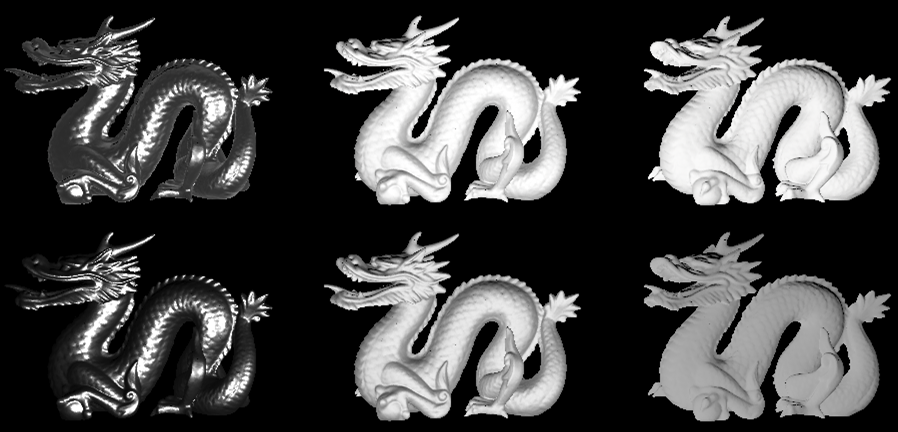
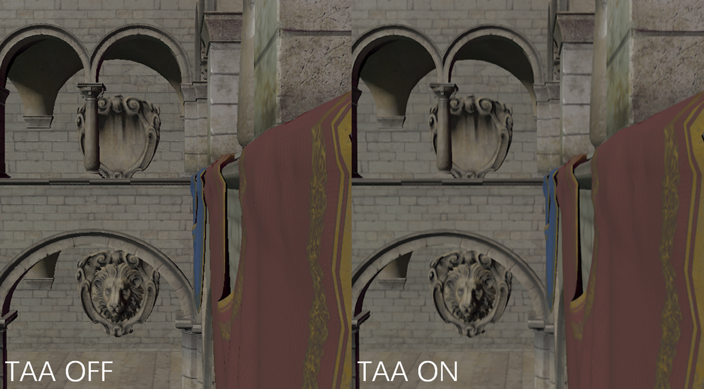

# Ilum(WIP)

[](https://github.com/Chaf-Libraries/Ilum/actions/workflows/windows.yml) [](https://www.codacy.com/gh/Chaf-Libraries/IlumEngine/dashboard?utm_source=github.com&amp;utm_medium=referral&amp;utm_content=Chaf-Libraries/IlumEngine&amp;utm_campaign=Badge_Grade)

Ilum Graphics Playground, name after *Planet Ilum* from [Star Wars](https://starwars.fandom.com/es/wiki/Ilum)


## Build

* Windows 10
* Visual Studio 2019
* C++17
* CMake 3.14+

Run:

```shell
git clone https://github.com/Chaf-Libraries/Ilum --recursive
mkdir build
cd build
cmake ..
cmake --build ./ --target ALL_BUILD --config Release
```

## Vulkan Requirement

* Instance Extension
  * `VK_KHR_surface`
  * `VK_KHR_win32_surface`
  * `VK_EXT_debug_report`
  * `VK_EXT_debug_utils`
* Validation Layers
  * `VK_LAYER_KHRONOS_validation`
* Device Extension
  * `VK_KHR_swapchain`
  * `VK_KHR_acceleration_structure`
  * `VK_KHR_ray_tracing_pipeline`

## Feature

* Architecture
  * Deferred Shading Pipeline
  * Render Graph
    * Customize Render Pass (Graphics, Compute)
    * Auto Resource Transition
    * Render Passes Visualization
    * Render Pass Setting
  * Entity Component System
  * Asynchronous Resource Loading
  * Scene Loading/Saving
* Rendering Feature For Performance
  * Multi-Draw Indirect
  * Bindless Texture
  * Vertex/Index Buffer Packing
  * GPU Frustum Culling
  * GPU Back-Face Cone Culling
  * GPU Hierarchy Z Buffer Occlusion Culling
* Geometry
  * Curve Modeling
    * Bézier Curve
    * Cubic Spline Curve
    * B Spline Curve
    * Rational Bézier Curve
    * Rational B Spline Curve

  * Tensor Product Surface Modeling
    * Bézier Surface
    * B Spline Surface
    * Rational Bézier Surface
    * Rational B Spline Surface

* Lighting Model
  * PBR
    * Cook-Torrance BRDF
    * Kulla-Conty Approximation

* Post Processing
  * Temporal Anti-Alias
  * Blooming


## Feature

### Deferred Physical Based Shading


### Render Passes Visualization


### Meshlet Culling


#### Kulla Conty Approximation



#### Curve Modeling


## Surface Modeling


#### Temporal Anti-Alias



## TODO

More features are on their way:

* Image based lighting
* Shadow Mapping
* RTX
* GI
* Screen space
  * SSR
  * SSGI
  * SSAO
  * ...
* Simulation
  * Ridge body
  * Fluid
  * Cloth
* ...
