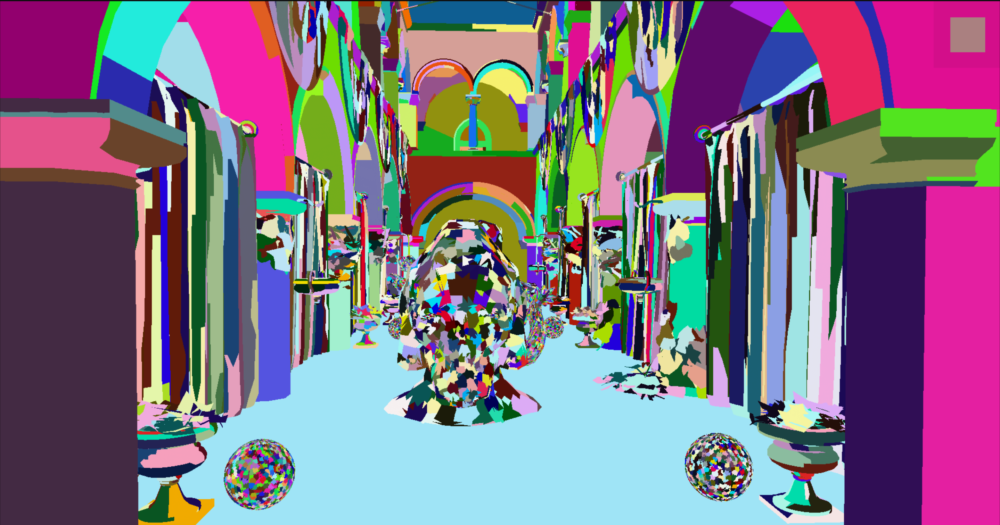
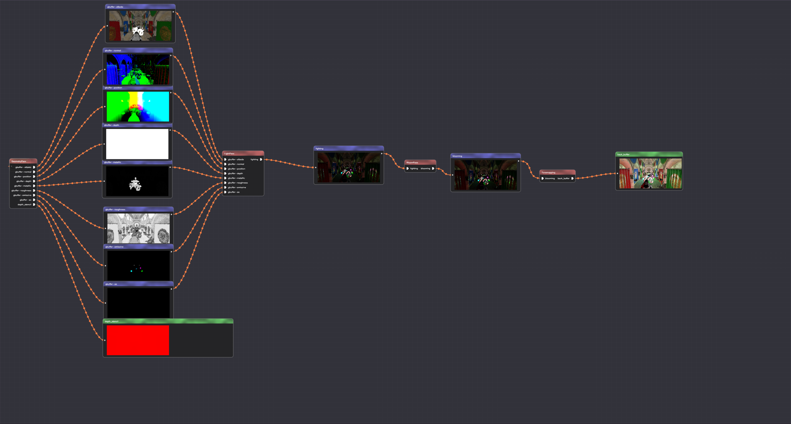

# Ilum(WIP)

[](https://github.com/Chaf-Libraries/Ilum/actions/workflows/windows.yml) [](https://www.codacy.com/gh/Chaf-Libraries/IlumEngine/dashboard?utm_source=github.com&amp;utm_medium=referral&amp;utm_content=Chaf-Libraries/IlumEngine&amp;utm_campaign=Badge_Grade)

Ilum Graphics Playground, name after *Planet Ilum* from [Star Wars](https://starwars.fandom.com/es/wiki/Ilum)

## Build

* Windows 10
* Visual Studio 2019
* C++17
* CMake 3.14+

Run:

```shell
git clone https://github.com/Chaf-Libraries/Ilum --recursive
mkdir build
cd build
cmake ..
cmake --build ./ --target ALL_BUILD --config Release
```

## Feature

* Architecture
  * Deferred Shading Pipeline
  * Render Graph
  * Entity Component System
  * Asynchronous Resource Loading
  * Scene Loading/Saving
* Rendering Optimization
  * Multi-Draw Indirect
  * Bindless Texture
  * Vertex/Index Buffer Packing
  * GPU Frustum Culling
  * GPU Back-Face Cone Culling
  * GPU Hierarchy Z Buffer Occlusion Culling
* Rendering Feature
  * PBR Material
* Post Processing
  * Blooming

## Upcoming Feature

* Skybox
* Image Based Lighting
* Path Tracing


## Screenshot







## TODO

More features are on their way:

* Image based lighting
* Shadow
* RTX
* GI
* Screen space
  * SSR
  * SSGI
  * SSAO
  * ...
* Simulation
  * Ridge body
  * Fluid
  * Cloth
* ...
