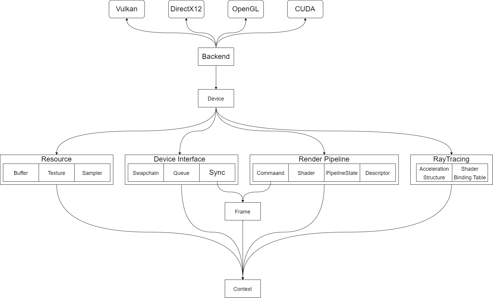

# Ilum(WIP)

 

Ilum Graphics Playground, name after *Planet Ilum* from [star wars]()

## TODO List

- [ ] RHI
  - [x] Vulkan
  - [ ] DirectX12
  - [x] CUDA
  - [ ] OpenGL
- [ ] RenderCore
  - [x] Shader Compiler
    - Source: GLSL/HLSL
    - Target: SPIRV/DXIL/PTX
  - [x] Shader Reflection: SPIRV reflection
  - [ ] Render Graph
    - [ ] Static Compilation
    - [ ] Auto Barrier Insert
    - [ ] Texture Memory Aliasing
  - [ ] Material Graph
- [ ] Scene Manager
  - [ ] Entity Component System
  - [ ] Asset Manager
  - [ ] Model Importer
    - [ ] .gltf
    - [ ] .obj
    - [ ] .fbx

## Feature

### Multiple Graphics/GPU Computation API Backend Support

### Cross Platform Shader Compilation

### Dynamic Reflection & ANTLR C++ Parsing Registeration

## Dependencies

* [ImFileDialog](https://github.com/dfranx/ImFileDialog)
* [ImGuizmo](https://github.com/CedricGuillemet/ImGuizmo)
* [assimp](https://github.com/assimp/assimp)
* [cereal](https://github.com/USCiLab/cereal)
* [DirectXCompiler](https://github.com/microsoft/DirectXShaderCompiler)
* [eigen](https://gitlab.com/libeigen/eigen)
* [entt](https://github.com/skypjack/entt)
* [glm](https://github.com/g-truc/glm)
* [glslang](https://github.com/KhronosGroup/glslang)
* [imgui](https://github.com/ocornut/imgui)
* [imgui-node-editor](https://github.com/thedmd/imgui-node-editor)
* [stb](https://github.com/nothings/stb)
* [VulkanMemoryAllocator](https://github.com/GPUOpen-LibrariesAndSDKs/VulkanMemoryAllocator)
* [volk](https://github.com/zeux/volk)
* [Vulkan-Headers](https://github.com/KhronosGroup/Vulkan-Headers)
* [oneTBB](https://github.com/oneapi-src/oneTBB)
* [meshoptimizer](https://github.com/zeux/meshoptimizer)
* [spdlog](https://github.com/gabime/spdlog)
* [SPIRV-Cross](https://github.com/KhronosGroup/SPIRV-Cross)

## Reference

* [https://www.pbr-book.org/](https://www.pbr-book.org/)
* [http://www.realtimerendering.com/](http://www.realtimerendering.com/)
* [https://learnopengl-cn.github.io/](https://learnopengl-cn.github.io/)
* [https://hazelengine.com/](https://hazelengine.com/)
* [https://advances.realtimerendering.com/s2015/aaltonenhaar_siggraph2015_combined_final_footer_220dpi.pdf](https://advances.realtimerendering.com/s2015/aaltonenhaar_siggraph2015_combined_final_footer_220dpi.pdf)
* [https://www.gdcvault.com/play/1024612/FrameGraph-Extensible-Rendering-Architecture-in](https://www.gdcvault.com/play/1024612/FrameGraph-Extensible-Rendering-Architecture-in)
* [https://github.com/SaschaWillems/Vulkan](https://github.com/SaschaWillems/Vulkan)
* [https://github.com/KhronosGroup/Vulkan-Samples](https://github.com/KhronosGroup/Vulkan-Samples)
* [https://github.com/wdas/brdf](https://github.com/wdas/brdf)
* [http://blog.selfshadow.com/publications/s2015-shading-course/burley/s2015_pbs_disney_bsdf_notes.pdf.](http://blog.selfshadow.com/publications/s2015-shading-course/burley/s2015_pbs_disney_bsdf_notes.pdf.)
* [https://www.froyok.fr/blog/2021-12-ue4-custom-bloom/](https://www.froyok.fr/blog/2021-12-ue4-custom-bloom/)

