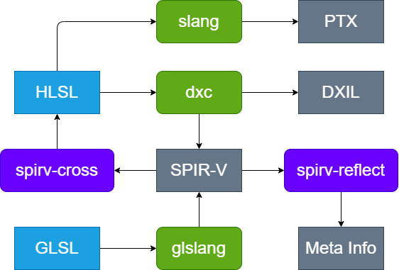
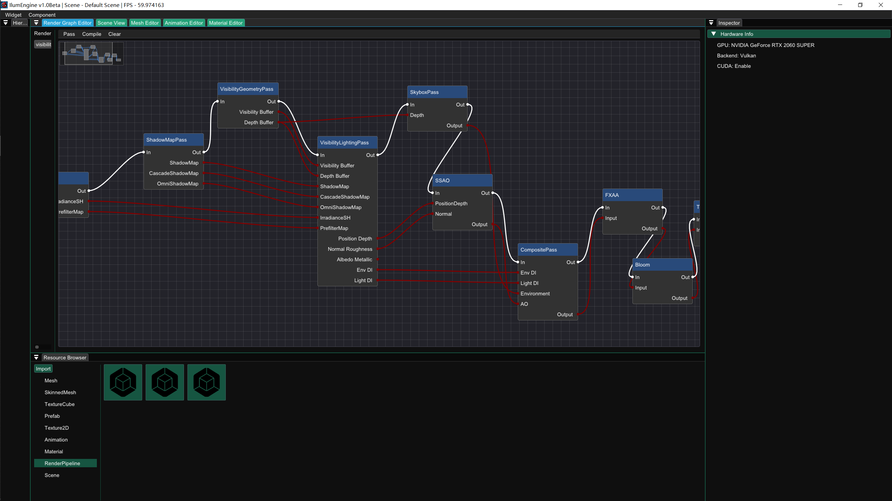
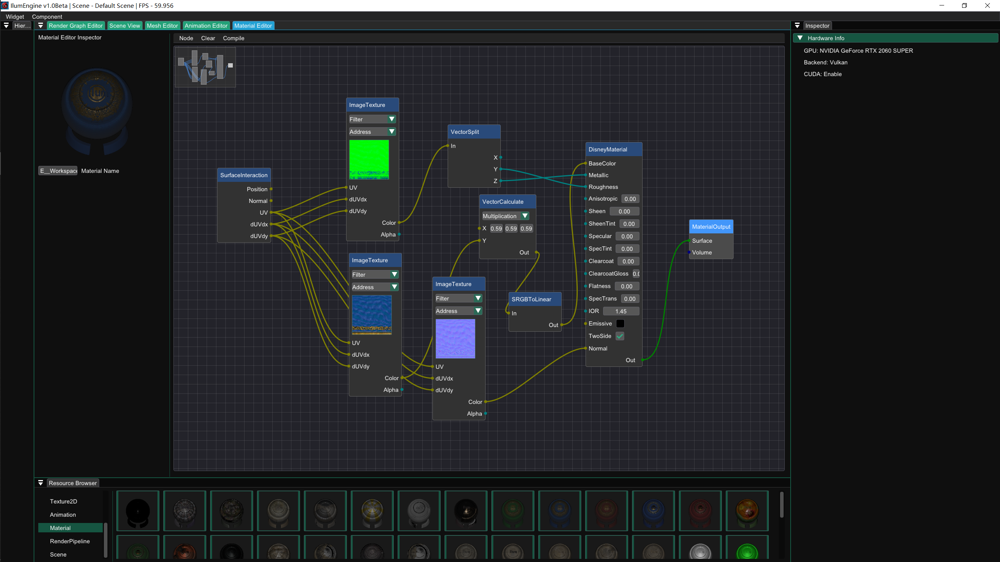

# Ilum(WIP)

[](https://github.com/Chaf-Libraries/Ilum/actions/workflows/windows.yml) [](https://www.codacy.com/gh/Chaf-Libraries/IlumEngine/dashboard?utm_source=github.com&amp;utm_medium=referral&amp;utm_content=Chaf-Libraries/IlumEngine&amp;utm_campaign=Badge_Grade)

Ilum Graphics Playground, name after *Planet Ilum* from [star wars](https://starwars.fandom.com/wiki/Ilum).

A framework for computer graphics learning and practice (It's not a game engine!)


## Install

**Platform**

* Windows 10
* Visual Studio 2022
* xmake >= v2.7.5
* [optional] CUDA >= 11.7

**Build**

Ilum uses [xmake](https://xmake.io/#/) for building. You can compile the whole project by simply run command:

```shell
xmake -y
```

or you can open the project in Visual Studio by generating `.sln` file:

```shell
xmake project -k vsxmake
```

## Feature

### Cross-Platform RHI

* Vulkan
  * Mesh Shading
  * Dynamic Rendering
  * Ray Tracing Pipeline
  * Draw/Dispatch Indirect
  * Bindless Resource

* CUDA
  * CUDA & Vulkan Interop


### Resource Manager


### Scene Graph


### Shader Compilation



### Render Graph

* Static compilation
* Automatic resource state tracking and transition
* Texture memory aliasing
* Seamless interoperation between Graphics API and CUDA
* Easy to customize render pass

**Render Pass**

* Visibility Deferred Shading Pipeline

  * Visibility Geometry Pass
    * Mesh shading with meshlet frustum culling (if device support `mesh_shader`)
    * Usual rasterization without optimization

  * Visibility Buffer Visualization
    * Visualize visibility buffer: instance and primitive
  * Visibility Buffer Lighting Pass
    * Indirect dispatch to support multiple material graphs
    * Generate lighting result and GBuffer

* Shadow

  * Classic Shadow Map (Spot Light)
  * Omnidirectional Shadow Map (Point Light)
  * Cascade Shadow Map (Directional Light)

* Ambient Occlusion
  * SSAO

* IBL
  * Spherical Harmonic Encoding Diffuse
  * Pre-Filter For Specular

* Ray Tracing
  * Path Tracing
* Post Process
  * Tone Mapping
  * Bloom
  * FXAA

**TODO**

* Resource Pool
* Runtime compilation maybe
* Multi-threading

### Material Graph

**Feature**

* Static compilation and HLSL generation
* Easy to customize material node
* Support usual BSDF models

### Plugins

You can extend the renderer features by adding these plugins:

* RHI
* Render Pass
* Material Node
* Importer
* Editor

#### Customize Render Pass


#### Customize Material Node


## Gallery

### Render Graph Editor



### Material Graph Editor



### Path Tracing


## Reference

* [https://www.pbr-book.org/](https://www.pbr-book.org/)
* [http://www.realtimerendering.com/](http://www.realtimerendering.com/)
* [https://learnopengl-cn.github.io/](https://learnopengl-cn.github.io/)
* [https://hazelengine.com/](https://hazelengine.com/)
* [https://advances.realtimerendering.com/s2015/aaltonenhaar_siggraph2015_combined_final_footer_220dpi.pdf](https://advances.realtimerendering.com/s2015/aaltonenhaar_siggraph2015_combined_final_footer_220dpi.pdf)
* [https://www.gdcvault.com/play/1024612/FrameGraph-Extensible-Rendering-Architecture-in](https://www.gdcvault.com/play/1024612/FrameGraph-Extensible-Rendering-Architecture-in)
* [https://github.com/SaschaWillems/Vulkan](https://github.com/SaschaWillems/Vulkan)
* [https://github.com/KhronosGroup/Vulkan-Samples](https://github.com/KhronosGroup/Vulkan-Samples)
* [https://github.com/wdas/brdf](https://github.com/wdas/brdf)
* [http://blog.selfshadow.com/publications/s2015-shading-course/burley/s2015_pbs_disney_bsdf_notes.pdf.](http://blog.selfshadow.com/publications/s2015-shading-course/burley/s2015_pbs_disney_bsdf_notes.pdf.)
* [https://www.froyok.fr/blog/2021-12-ue4-custom-bloom/](https://www.froyok.fr/blog/2021-12-ue4-custom-bloom/)

* [https://filmicworlds.com/blog/visibility-buffer-rendering-with-material-graphs](https://filmicworlds.com/blog/visibility-buffer-rendering-with-material-graphs)
